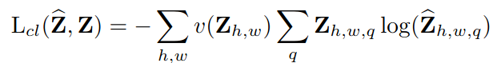
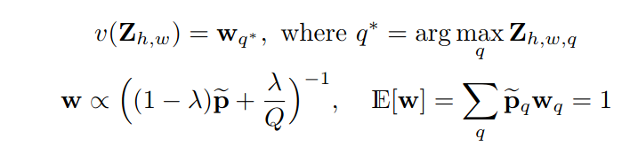
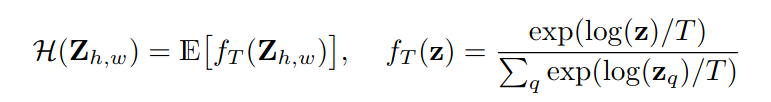
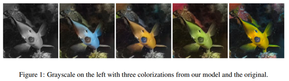
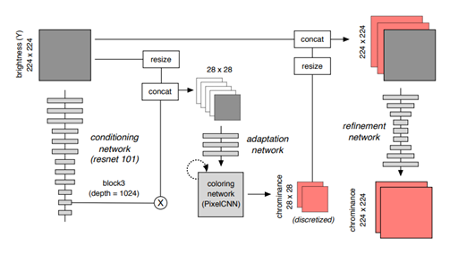
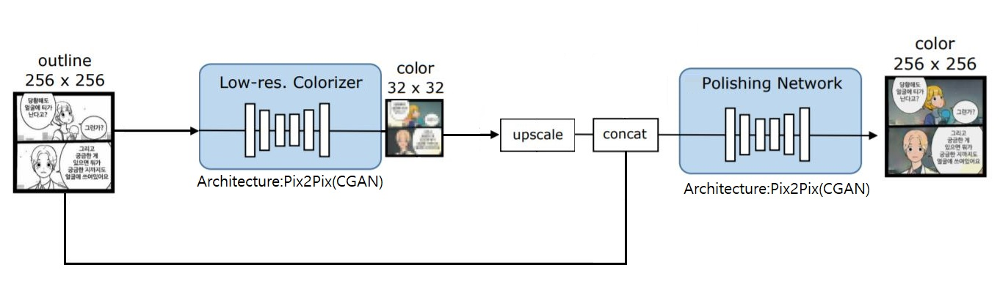

auto_colorization_project

# 1.Paper Study

## 1.1.Survey

자동채색 알고리즘은 다양한 방향으로 연구되고 있으며, 기법에 따른 분류, 도메인에 따른 분류, 모델에 따른 분류로 나눌 수 있다.

논문 연구 및, 구현, 그 외에 데모 구현 등에 필요한 시간 등을 종합적으로 고려해 보았을 때, 논문 연구 대상으로 아래 논문들을 선정하였다.

**Deep Colorization**(완전자동, Deterministic Model, Gray Scale Domain)

**Colorful Image Colorization**(완전자동, Deterministic Model, Gray Scale Domain)

**Pixel Recurrent Neural Network**(Auto-Regressive Model Base 논문)

**Conditional Image Generation with PixelCNN Decoders**(Auto-Regressive Model Base 논문)

**Consistent Comic Colorization with Pixel-wise Background Classification**(완전자동, Auto-Regressive Model, Line and Point Domain)

**PixColor**(완전자동, Auto-Regressive Model, Gray Scale Domain)

　

직접적인 구현 대상으로는 아래 알고리즘들을 선정하였다.

**Colorful Image Colorization**(완전자동, Deterministic Model, Gray Scale Domain)

**2-Step Pix2Pix for Comic Colorization**(완전자동, GAN Model, Line and Point Domain)

**PixColor**(완전자동, Auto-Regressive Model, Gray Scale Domain)

　

## 1.2.[Consistent Comic Colorization with Pixel-wise Background Classification](https://nips2017creativity.github.io/doc/Consistent_Comic_Colorization.pdf)

### 1.2.1.Idea
이 논문의 주요한 Contribution은 기존에 제안되었던 Auto-colorization기법들이 Background-consistent한 결과물을 내놓지 못하던 문제를 Background Detector를 도입함으로서 해결하였다는 것이다.
이 논문에 제안된 모델은

1. 실질적인 Outline Colorization을 담당하는 **Low-resolution Colorizer**, 

2. 전경과 후경을 분류하는 **Background Detector**, 

3. 최초 Input인 Outline, Low-resolution Colorizer의 Output인 Low-resolution Image, Background Detector의 Output인 Background-Foreground Segment를 받아 Background-consistent하게 Resolution을 복구하는 **Polishing Network**로 나뉜다.

이 논문의 핵심 아이디어인 Background Detector는 전, 후경을 직접 Labeling하는 지도학습 방법대신, 독특한 비지도학습 방법으로 학습된다. 

마스크를 하나 만든 뒤, 전경으로 분류된 픽셀은 Low-resolution Image의 값으로, 후경으로 분류된 픽셀은 Ground-Truth에서 해당 Index에 해당하는 픽셀의 값들을 얻은 뒤 Mean한 값 하나로, 즉 단색으로 덮어버린다. 이렇게 만든 이미지와 Ground-Truth의 L1-loss를 최소화하게 학습시킨다. 

이게 되는 이유는 캐릭터나 말풍선의 색은 다수의 데이터에 걸쳐 유사한 패턴으로 반복되는 반면, 후경의 색은 일반적으로 뚜렷한 패턴없이 정해지기 때문이다. 따라서 Low-resolution Colorizer는 전경에 해당하는 부분(말풍선, 캐릭터 등)은 잘 복원하는 반면 후경에 해당하는 부분은 잘 복원하지 못 할것이다. 

또한 일반적으로 일반적으로 후경은 Consistent하기 때문에 해당 부분 픽셀들을 Mean해서 단색으로 덮어도 Ground-Truth와 차이가 크지 않을 것이다. 따라서 Low-resolution Colorizer에 의해 복원된 후경보다 Ground-Truth로부터 Mean해서 얻은 단색후경이 Ground-Truth에 더 가까울 것이다. 

"뭐하러 Mean한 단색으로 덮는가, 그냥 Ground Truth를 그대로 쓰면 안되냐?"라는 의문이 들 수 있지만 조금만 생각해보면 이게 불가능하다는 것을 알 수 있다. 

Ground Truth를 그대로 쓰면 그냥 이미지 전체를 후경으로 취급해버리는게 L1 Loss가 가장 작게 나오기 때문이다. 일반적으로 후경은 Consistent하고 캐릭터, 말풍선은 후경과 뚜렷하게 구분되게 그려진다는 만화의 Domain적 특성을 잘 활용한 상당히 깜찍한 아이디어라고 할 수 있다. 다만 이러한 특성이 

1. **전경과 후경이 뚜렷히 구분되지 않게 그려지는 화풍을 가진 만화**(예를 들어 흰 후경이 잦은 만화를 학습데이터로 쓴다면 아마 말풍선과 후경을 잘 분리하지 못하게 학습될 것이다.),

2. **배경이 단색이 아닌 복잡한 패턴을 가져 Mean해버리기에 무리가 있는 만화**(애초에 이 모델은 후경이 어느정도 Consistent하다는 가정에서 짜여진 모델이다.)

들에 대해 한계를 가지게 될 것 같다.

### 1.2.2.Detail
#### 1.2.2.1.Dataset
유미의 세포들이라는 만화의 첫 화부터 238화까지, 총 7394개 이미지를 256x256으로 resize해서 사용했다고 한다. 데이터를 대충 훑어보니 대부분이 컷 분할이 깔끔하고 종횡비의 차가 크지 않은 컷이라 데이터셋으로 쓰기 좋아보였다. 생각보다 데이터가 깔끔해서 아마 전처리보다는 크롤러 만들어서 긁어오는데 더 많은 시간을 소요할 것으로 보인다.

#### 1.2.2.2.Low-resolution Colorizer
 기본적인 구조는 Pixcolor: Pixel recursive colorization([https://arxiv.org/abs/1705.07208])의 것을 따르고 있으며, 전이학습을 하지 않는 점, 적은 Dataset에 대해 더 나은 성능을 얻기위해 Logistic Mixture Model([https://arxiv.org/abs/1701.05517])을 사용했다는 점이 차이점이다. Canny-edge와 원래 검게 칠해진 부분을 더해 얻은 Outline을 Input으로 하고 Ground-truth를 32x32까지 Downsample한 영상을 Output으로 한다.

Pixcolor: Pixel recursive colorization을 이해하기 위해선 영상 도메인에서의 Auto Regressive 모델들에 대해 알아야 한다. Auto Regressive 모델들은 대부분 단순 Image-to-Image CNN 모델들보다 Multimodality가 강하다는 점이 특징이다. 이를 위해 기본적으로 대부분의 모델들이 출력으로 Actual Value를 뱉는 것이 아니라 확률분포에서 샘플링하는 방법을 택하고 있다. 또한 Multimodality를 얻기위해 단순 가우시안 분포를 매핑하는 L2 Regression은 사용하지 않는다. 대신 카테고리컬 분포를 매핑하는 Softmax Classification이나 카테고리컬 분포가 이웃한 값간의 수학적 관계를 무시한다는 한계(반면 L2 regression은 이러한 수학적 관계를 잘 나타내지만 Multimodality를 모델링할 수 없다.)를 극복하기 위해, Logistic Mixture Model등의 모델을 사용하기도 한다. 

이렇게 모델링한 확률분포에서 샘플링을 하면 영상이 Multimodal해질까? 그렇지는 않은데, 모든 픽셀을 주변픽셀에 대한 고려없이 무작정 독립적으로 샘플링해버리면 그 결과물은 노이즈에 지나지 않으며 아마 Actual Value로 생성한 Single Mode 영상보다 퀄리티가 형편 없을 것이다. 따라서 우리는 각각의 픽셀이 종속성을 갖도록 영상을 생성하는 방법에 대해 생각해야 한다.

영상 도메인에서의 Auto Regressive 모델들의 기본가정은 영상공간에서의 픽셀들이 특정방향으로 Sequential하다는 것이다. 대표적인 Auto Regressive 모델인 PixelRNN을 살펴보면,

영상의 픽셀들이 좌상->우하 방향으로 Sequential하다는 것을 가정한 후, RNN계열의 Gated Unit들을 통해 좌상단에서부터 재귀적으로 픽셀을 샘플링해나간다. 이렇게 하면 분명히 퀄리티가 괜찮은 MultiMode 영상을 얻을 수 있을 것이다. 다만 RNN계열 모델 특성상 병렬처리를 지원하지 않아 엄청나게 느리다.

그래서 성능을 어느정도 내주고 학습속도를 얻은 PixelCNN같은 모델들이 등장하게 된다. 이 모델은 그림과 같이 생긴 Convolutional Filter를 이용해, 여러번 Convolve하여 마치 좌상단 피쳐맵으로부터 나온값이 중앙에 전달되고 이것들이 다시 Sequential하게 우하단으로 전달되는 모양새를 띈다. PixelCNN에 대해선 바로 이 논문 다음으로 공부하고 구현해 볼 것이다.

#### 1.2.2.3.Background Detector
기본적인 구조는 Image-to-Image Translation with Conditional Adversarial Networks([https://arxiv.org/abs/1611.07004])의 것을 따르고 있으며, 최종단의 Binary한 Output을 Gumbel-Softmax로 얻는다.(https://arxiv.org/abs/1611.01144) 이후 위에 언급했듯, 전경으로 분류된 부분엔 Low-resolution Colorizer의 값을 곱하고, 후경으로 분류된 부분엔 같은 Index를 가진 Ground-truth 값들의 평균을 곱한다. 이 둘을 합해 얻은 이미지와 Ground-truth간의 L1 Loss를 Minimize하게 학습시킨다. 

#### 1.2.2.4.Polishing Network
기본적인 구조는 Image-to-Image Translation with Conditional Adversarial Networks([https://arxiv.org/abs/1611.07004])의 것을 따르고 있으며, 

1. 최초 Input인 Outline(1 channel), 

2. Low-resolution Colorizer의 Output인 Low-resolution Image(3 channel),

3. Background Detector의 Output인 Background-Foreground Segment(각각 반전하여 하나씩 2 channel)

4. Mask(1 channel)

5. Low-resolution Image의 후경 픽셀들의 값의 평균(3 channel)

총 10 channel의 Image를 Input으로 받아 Background-consistent하게 Resolution을 복구한다. 

모델이 1번 Low-resolution Image에 과의존하는 것을 막기위해 Low-resolution Image에서 후경으로 분류된 부분 중 일부를 Random하게 Mask하는데 이때 Masking하는 값은 앞서 숱하게 사용한 후경 픽셀들의 값의 평균이다. 

4번 Mask는 Random Noise 줄 때 사용한 Noise의 마스크이다.[

5번 Low-resolution Image의 후경 픽셀들의 값의 평균(3 channel)은 Background로 분류된 픽셀들에만 Masking한 형태로 사용한다.

## 1.3.[Deep Colorization](https://arxiv.org/abs/1605.00075)

### 1.3.1.Summary
아마 완전 자동채색 분야의 Pioneer Paper로 추정된다. 초기 Neural Net 기반 채색이 어떠했는지 맥락만 살피는 의미에서 간략하게 요약해본다. 

일단 Neural Net으로 완전히 End-to-End는 아니고, 학습과정에서 Semantic Histogram으로 클러스터링을 한 뒤 각 클러스터별로 해당 Category의 채색에 특화된 Neural Net을 각각 하나씩 학습시키는 방법이다.

일단 입력으로는 YUV Color Space를 사용한다.(각 채널간의 Correlation이 적다고 함)

Handmade feature는 각 픽셀별로 추출되고, Low-level, Mid-level, High-level의 Feature를 모두 사용한다. Low-level-feature는 7x7 범위의 이웃한 픽셀, Mid-level-feature는 DAISY, High-level-feature는 FCN의 Output(Semantic Class Label)을 사용한다. 완전 고전 특징들만 쓸줄 알았는데 의외로 Neural Net의 아웃풋을 통째로 High-level-feature로 쓴다.

High-Level-Feature로부터 Semantic Histogram을 구한 후, K-means 클러스터링을 한다. 이후 각 클러스터마다 해당 클러스터에 특화된 Neural Net을 학습시킨다. 테스트시에는 NN으로 속하는 클러스터를 찾은 뒤 해당 클러스터에 해당하는 Neural Net으로 채색을 진행한다.

채색 후 각 픽셀별로 Chrominance값을 얻는데, 하늘이나 바다같은 Low-texture Objects가 Noisy하게 채색되는 문제가 있다. [Joint Bilateral Filtering Technique](http://research.microsoft.com/~hoppe/flash.pdf)으로 노이즈를 감소시켜 최종 Chrominance값을 얻는다. 이후 이를 Luminance값(Greyscale Image)과 결합하여 최종 채색결과물을 얻는다.

## 1.4.[Colorful Image Colorization](https://arxiv.org/pdf/1603.08511.pdf)

### 1.4.1.Idea

그동안 자동채색 분야는 위 Deep Colorization에 비해 많은 발전을 거듭해 클래스마다 따로 모델을 하나하나 만들 필요도 없어졌고, Handmade Feature를 쓰는 데에서도 벗어나 Neural Net만으로도 준수한 성능을 내게 되었다. 이때 주로 쓰이는 방식은 Pixelwise하게 Output을 Ground Truth로 Regression 시키는 것이다. 

다만 Pix2Pix같은 Regression 방식의 문제점은 각각의 Output이 평균(중심)이 다른 정규분포를 따르기 때문에 Multimodal한 분포를 매핑하려 할 경우 모델입장에서 가장 안전한 분포를 매핑하려 하기때문에 결과물들의 채도가 전반적으로 떨어지는 문제가 있었다.
예를 들자면 풀이나 하늘같은 건 상대적으로 Singlemodal하다. 각각 초록색, 하늘색으로 채색하면 되기 때문이다. 그런데 사과같은건 빨간색으로 칠할지 초록색으로 칠할지가 애매하다. 이런 경우 양쪽의 L2 Loss를 최소화하려면 빨강과 초록 중간쯤의 채도가 떨어지는 색이 모델입장에서 가장 안전한 채색이 된다.

이러한 문제점을 해결하기 위해 이 논문의 저자는 Pixelwise Classification 방식을 제안한다. Cross Entropy Loss를 사용할 경우 Categorical 분포를 매핑하게 되기 때문에 채도가 떨어지는 문제는 확실하게 개선할 수 있다. 다만 이 방식이 Multimodality 문제를 완전히 해결한 것은 아니다. 모델 자체가 Deterministic하기 때문에 하나의 Input엔 하나의 Output이 대응될 뿐이다. 단지 Multimodal 분포를 Deterministic한 모델로 매핑할려하면 채도가 떨어지는 문제점만을 개선했다고 보아야한다.

이론적으로 컴퓨터상에 나타낼 수 있는 모든 색의 분포를 Class화할려면 총 255 * 255 * 255 Class가 필요하지만, 이 논문의 저자는 영상을 Lab 색공간으로 변환한 후, L(Intensity)은 Input으로부터 그대로 얻어오고, 색차를 나타내는 a, b를 이로부터 얻도록 했다. 그렇게 가능한 a, b 순서쌍의 집합들을 10 grid로 나눠서 총 313 class로 양자화했다. 이후 Inference시엔 최종적으로 얻어진 분포로부터 Annealed Mean을 취해 최종적으로 채색할 색을 결정한다. 즉 2 step 방식이다.

### 1.4.2.Detail

#### 1.4.2.1.Loss Function

Z는 영상으로, Z hat은 Logit, 그냥 Z는 Label이다. h, w, q는 각각 y축, x축, 클래스(양자화된 색의 값, 총 313개) 차원을 나타낸다. v는 Class Rebalancing 함수를 나타낸다. 즉 위 수식은 Class Rebalancing 함수가 있는 점을 제외하면 일반적인 Pixelwise Classification 손실함수다. 하나 특기할 점은 Label을 One-hot-Encoding하지 않고 Soft-Encoding한다. GT와 가장 가까운 1개 Class를 1로 Encoding하는 대신, 가장 가까운 5개 Class를 Soft-Encoding한다. 각각의 값은 1을 표준편차 5의 가우시안 커널로 Smoothing한 값이다. (약 0.96, 0.01, 0.01, 0.01, 0.01 정도된다.)

#### 1.4.2.2.Class Rebalancing Function

Class Rebalancing이 필요한 이유는 ImageNet이나 COCO같은 General Image Dataset은 대부분의 픽셀이 채도가 낮은 색으로 이루어져 있다.(거기다 COCO는 아예 흑백, 세피아톤 영상도 여럿 섞여있어서 전처리 시 전체적인 채도를 기준으로 이러한 영상들을 필터링할 필요가 있었다.) 따라서 등장 빈도에 따라 색들을 Weighting할 필요가 있다. 수식에서 v는 Rebalacing 함수. w는 weight. lambda는 두 분포(바로 밑에서 언급하겠지만 원본분포를 균등분포와 혼합한다.)간 비율을 조절해주는 계수. Q는 총 클래스 수, E[w]는 Weight의 기대값을 나타내는 것이다.  

윗 줄은 q가 각 픽셀에서 가장 Probability가 높게 나온 픽셀임을 나타낸다. 밑 줄의 첫 번째 항은 w가 원본분포와 균등분포를 lambda를 모수로 섞인 분포와 비례함을 나타내고, 두 번째 항은 이렇게 구한 w의 기대값이 1이어야 한다는 것을 나타낸다. 이를 이용해 각 클래스에 해당하는 Rebalancing Weight를 구할 수 있다.

#### 1.4.2.3.Class Probabilities to Point Estimates Function

위 Neural Net의 Output으로 나온 확률 분포를 실제 색으로 매핑해주는, Neural Net과는 별개로 작동하는 디코딩 함수이다. z는 확률, T는 분포의 첨도를 조절하기 위한 모수인 Temperature다.

분포를 색으로 매핑하는 방식은 크게 두 가지다. 기댓값을 취하는 방법, 확률이 가장 큰 값 하나만 취하는 방법이다. 위 사진의 가장 왼쪽은 기댓값을 취한 채색결과를, 가장 오른쪽은 확률이 가장 큰 값만 취한 채색결과를 보여준다. 각각의 장단점이 극명하게 보인다. 기댓값을 취할경우, Consistency가 높지만 채도가 심히 낮고, 가장 큰 확률만 취할 경우 반대로 채도가 높지만 Consistency가 떨어진다.

이 둘을 적절하게 섞기 위해 저자는 Annealed Mean을 취했다고 한다. 수식에서 log(z)를 확률을 Logit으로 근사하는 역할로 보면 Temperature Scaling과 거의 유사한 수식인 것을 알 수 있다. 즉, 확률분포의 첨도를 조절해서 이 분포의 기댓값을 취하는 방식을 Annealed Mean이라고 하는 것 같다.

## 1.5.PixColor

### 1.5.1.Idea

이 논문은 Auto-Regressive Generative Model인 PixelCNN을 자동채색에 도입해 높은 성능을 낸 논문이다. 자동채색에 Auto-Regressive Model을 사용했을 때의 장점은 Multimodal한 객체를 다양한 Mode에서 높은 채도로 채색할 수 있다는 점, 한 픽셀, 한 픽셀을 이전 픽셀들과의 Dependency를 고려하여 샘플하기 때문에 높은 Consistency를 보여준다는 점, 그리고 생성물의 분포를 Log Likelihood로 명시적으로 확인할 수 있다는 점 등이 있다. 

단 Auto-Regressive Model은 학습 시엔 (Teacher Forcing 상황을 가정하여) 병렬화가 가능하지만 Inference 속도는 한 픽셀 한 픽셀 만드느라 엄청나게 느리다. 이러한 단점을 커버하기 위해 이 논문에선 작은 해상도(28x28)의 Chrominance를 출력한다. 이렇게 해도 되는 이유는 사람이 Luminance 변화보다 Chrominance 변화에 덜 민감하기 때문이다. 실제로 논문에서 사진으로 든 예시를 보면 이를 직관적으로 이해할 수 있다. 고해상도의 Luminance에 저해상도의 Chrominance를 그냥 Bilinear Interpolation해서 더해버려도, 원본과 큰 차이를 느낄 수 없는 것을 알 수 있다.

따라서 PixelCNN의 출력으로 28x28의 저해상도 Chrominance를 출력해도 채색성능에 큰 문제가 없다. 하지만 이 논문에선 성능을 더 높이기 위해 Refinement Network을 별로도 만들어 Super Resolution하여 더 좋은 채색성능을 얻었다.

### 1.5.2.Detail

이 논문의 Architecture는 정말 간략하게 서술되어 있다. 먼저 크게 Low-Resolution Colorization Network와 Refinement Network로 나뉘고, 이 두 모델은 서로 독립적이다. 두 모델을  End-to-End로 안하고 독립적으로 학습시키는 이유는, End-to-End로 학습시키게 되면, Low-Resolution Colorization Network가 뱉는 Multimodal한 결과들을 모두 하나의 Mode(GT)로 만들어버리게 된다. 따라서 두 모델을 독립적으로 학습시킨다.

Low-Resolution Colorization Network는 기본적으로 Pixel recursive super resolution (https://arxiv.org/abs/1702.00783)의 구조와 유사한 구조를 가지고 있다. Encoding Part는 Resnet과 Unet을 합쳐놓은 듯한 Architecture를 가지고 있다. Luminance Image를 입력으로 받은 Resnet-101의 3번째 블록에서 임베딩 Feature Map을 뽑아서(Conditioning Network) 1x1 Convolution을 적용해 채널수를 4로 줄인다. 이후 Luminance Image와 Concat해서 (Unet Connection과 유사한 부분) 28x28x5 Image로 만든 뒤, Adaptation Network를 통과시켜 나온 Feature Map을 PixelCNN에 통과시켜 28x28x2의 Chrominance Image를 얻는다. 여기서 사용하는 PixelCNN은 Original PixelCNN이 아닌 Gated PixelCNN이다. 

이후 Refinement Network는 Let there be Color!: Joint End-to-end Learning of Global and Local Image Priors for Automatic Image Colorization with Simultaneous Classification (http://iizuka.cs.tsukuba.ac.jp/projects/colorization/data/colorization_sig2016.pdf)의 구조를 따르되 레이어를 좀 더 쌓았고, Downsampling을 Strided Convolution이나 Pooling이 아닌 Bilinear Interpolation으로 수행했다고 한다.

# 2.Implementation

## 2.1.[Naive 2-step CGAN(2-step Pix2Pix)](https://github.com/demul/auto_colorization_project/tree/master/naive_two_step_CGAN)

상세한 구현과정과 코드는 상단 항목 제목의 [링크](https://github.com/demul/auto_colorization_project/tree/master/naive_two_step_CGAN) 참고

## 2.2.[Colorful Image Colorization](https://github.com/demul/auto_colorization_project/tree/master/colorful_image_colorization)

상세한 구현과정과 코드는 상단 항목 제목의 [링크](https://github.com/demul/auto_colorization_project/tree/master/colorful_image_colorization) 참고

## 2.3.[PixColor](https://github.com/demul/auto_colorization_project/tree/master/pixcolor)

상세한 구현과정과 코드는 상단 항목 제목의 [링크](https://github.com/demul/auto_colorization_project/tree/master/pixcolor) 참고
