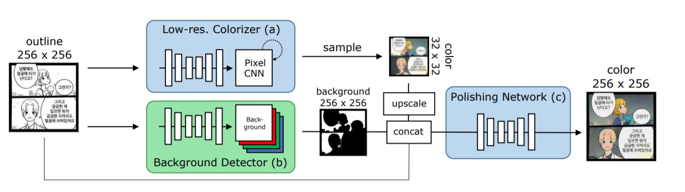
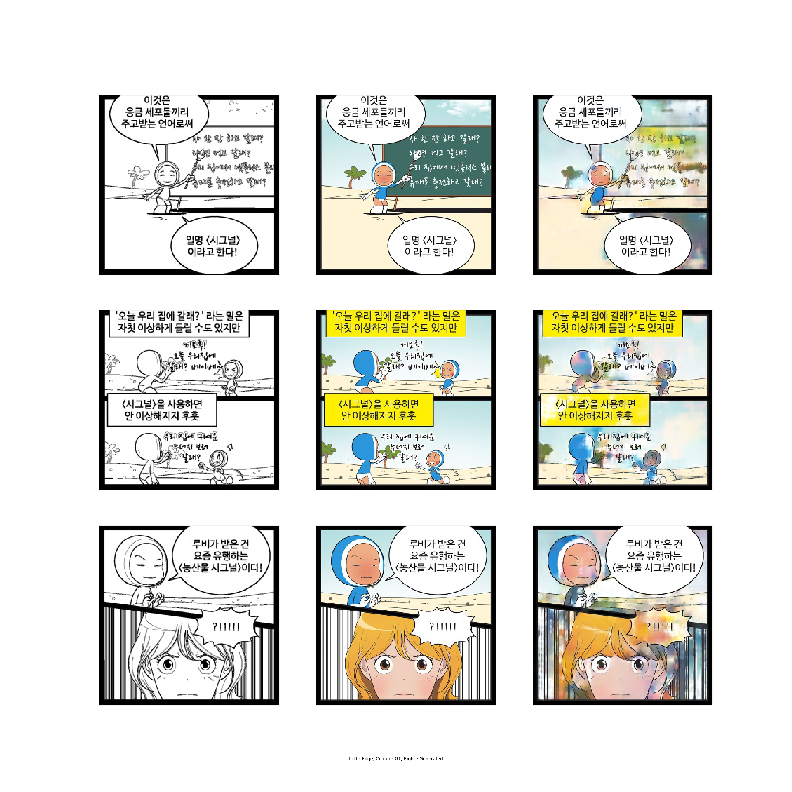

auto_colorization_project

# 1.Paper Study

## 1.1.[Consistent Comic Colorization with Pixel-wise Background Classification](https://nips2017creativity.github.io/doc/Consistent_Comic_Colorization.pdf)

### 1.1.1.Idea
이 논문의 주요한 Contribution은 기존에 제안되었던 Auto-colorization기법들이 Background-consistent한 결과물을 내놓지 못하던 문제를 Background Detector를 도입함으로서 해결하였다는 것이다.
이 논문에 제안된 모델은

1. 실질적인 Outline Colorization을 담당하는 **Low-resolution Colorizer**, 

2. 전경과 후경을 분류하는 **Background Detector**, 

3. 최초 Input인 Outline, Low-resolution Colorizer의 Output인 Low-resolution Image, Background Detector의 Output인 Background-Foreground Segment를 받아 Background-consistent하게 Resolution을 복구하는 **Polishing Network**로 나뉜다.

이 논문의 핵심 아이디어인 Background Detector는 전, 후경을 직접 Labeling하는 지도학습 방법대신, 독특한 비지도학습 방법으로 학습된다. 

마스크를 하나 만든 뒤, 전경으로 분류된 픽셀은 Low-resolution Image의 값으로, 후경으로 분류된 픽셀은 Ground-Truth에서 해당 Index에 해당하는 픽셀의 값들을 얻은 뒤 Mean한 값 하나로, 즉 단색으로 덮어버린다. 이렇게 만든 이미지와 Ground-Truth의 L1-loss를 최소화하게 학습시킨다. 

이게 되는 이유는 캐릭터나 말풍선의 색은 다수의 데이터에 걸쳐 유사한 패턴으로 반복되는 반면, 후경의 색은 일반적으로 뚜렷한 패턴없이 정해지기 때문이다. 따라서 Low-resolution Colorizer는 전경에 해당하는 부분(말풍선, 캐릭터 등)은 잘 복원하는 반면 후경에 해당하는 부분은 잘 복원하지 못 할것이다. 

또한 일반적으로 일반적으로 후경은 Consistent하기 때문에 해당 부분 픽셀들을 Mean해서 단색으로 덮어도 Ground-Truth와 차이가 크지 않을 것이다. 따라서 Low-resolution Colorizer에 의해 복원된 후경보다 Ground-Truth로부터 Mean해서 얻은 단색후경이 Ground-Truth에 더 가까울 것이다. 

"뭐하러 Mean한 단색으로 덮는가, 그냥 Ground Truth를 그대로 쓰면 안되냐?"라는 의문이 들 수 있지만 조금만 생각해보면 이게 불가능하다는 것을 알 수 있다. 

Ground Truth를 그대로 쓰면 그냥 이미지 전체를 후경으로 취급해버리는게 L1 Loss가 가장 작게 나오기 때문이다. 일반적으로 후경은 Consistent하고 캐릭터, 말풍선은 후경과 뚜렷하게 구분되게 그려진다는 만화의 Domain적 특성을 잘 활용한 상당히 깜찍한 아이디어라고 할 수 있다. 다만 이러한 특성이 

1. **전경과 후경이 뚜렷히 구분되지 않게 그려지는 화풍을 가진 만화**(예를 들어 흰 후경이 잦은 만화를 학습데이터로 쓴다면 아마 말풍선과 후경을 잘 분리하지 못하게 학습될 것이다.),

2. **배경이 단색이 아닌 복잡한 패턴을 가져 Mean해버리기에 무리가 있는 만화**(애초에 이 모델은 후경이 어느정도 Consistent하다는 가정에서 짜여진 모델이다.)

들에 대해 한계를 가지게 될 것 같다.

### 1.1.2.Detail
#### 1.1.2.1.Dataset
유미의 세포들이라는 만화의 첫 화부터 238화까지, 총 7394개 이미지를 256x256으로 resize해서 사용했다고 한다. 데이터를 대충 훑어보니 대부분이 컷 분할이 깔끔하고 종횡비의 차가 크지 않은 컷이라 데이터셋으로 쓰기 좋아보였다. 생각보다 데이터가 깔끔해서 아마 전처리보다는 크롤러 만들어서 긁어오는데 더 많은 시간을 소요할 것으로 보인다.

#### 1.1.2.2.Low-resolution Colorizer
 기본적인 구조는 Pixcolor: Pixel recursive colorization([https://arxiv.org/abs/1705.07208])의 것을 따르고 있으며, 전이학습을 하지 않는 점, 적은 Dataset에 대해 더 나은 성능을 얻기위해 Logistic Mixture Model([https://arxiv.org/abs/1701.05517])을 사용했다는 점이 차이점이다. Canny-edge와 원래 검게 칠해진 부분을 더해 얻은 Outline을 Input으로 하고 Ground-truth를 32x32까지 Downsample한 영상을 Output으로 한다.

Pixcolor: Pixel recursive colorization을 이해하기 위해선 영상 도메인에서의 Auto Regressive 모델들에 대해 알아야 한다. Auto Regressive 모델들은 대부분 단순 Image-to-Image CNN 모델들보다 Multimodality가 강하다는 점이 특징이다. 이를 위해 기본적으로 대부분의 모델들이 출력으로 Actual Value를 뱉는 것이 아니라 확률분포에서 샘플링하는 방법을 택하고 있다. 또한 Multimodality를 얻기위해 단순 가우시안 분포를 매핑하는 L2 Regression은 사용하지 않는다. 대신 카테고리컬 분포를 매핑하는 Softmax Classification이나 카테고리컬 분포가 이웃한 값간의 수학적 관계를 무시한다는 한계(반면 L2 regression은 이러한 수학적 관계를 잘 나타내지만 Multimodality를 모델링할 수 없다.)를 극복하기 위해, Logistic Mixture Model등의 모델을 사용하기도 한다. 

이렇게 모델링한 확률분포에서 샘플링을 하면 영상이 Multimodal해질까? 그렇지는 않은데, 모든 픽셀을 주변픽셀에 대한 고려없이 무작정 독립적으로 샘플링해버리면 그 결과물은 노이즈에 지나지 않으며 아마 Actual Value로 생성한 Single Mode 영상보다 퀄리티가 형편 없을 것이다. 따라서 우리는 각각의 픽셀이 종속성을 갖도록 영상을 생성하는 방법에 대해 생각해야 한다.

영상 도메인에서의 Auto Regressive 모델들의 기본가정은 영상공간에서의 픽셀들이 특정방향으로 Sequential하다는 것이다. 대표적인 Auto Regressive 모델인 PixelRNN을 살펴보면,

영상의 픽셀들이 좌상->우하 방향으로 Sequential하다는 것을 가정한 후, RNN계열의 Gated Unit들을 통해 좌상단에서부터 재귀적으로 픽셀을 샘플링해나간다. 이렇게 하면 분명히 퀄리티가 괜찮은 MultiMode 영상을 얻을 수 있을 것이다. 다만 RNN계열 모델 특성상 병렬처리를 지원하지 않아 엄청나게 느리다.

그래서 성능을 어느정도 내주고 학습속도를 얻은 PixelCNN같은 모델들이 등장하게 된다. 이 모델은 그림과 같이 생긴 Convolutional Filter를 이용해, 여러번 Convolve하여 마치 좌상단 피쳐맵으로부터 나온값이 중앙에 전달되고 이것들이 다시 Sequential하게 우하단으로 전달되는 모양새를 띈다. PixelCNN에 대해선 바로 이 논문 다음으로 공부하고 구현해 볼 것이다.

#### 1.1.2.3.Background Detector
기본적인 구조는 Image-to-Image Translation with Conditional Adversarial Networks([https://arxiv.org/abs/1611.07004])의 것을 따르고 있으며, 최종단의 Binary한 Output을 Gumbel-Softmax로 얻는다.(https://arxiv.org/abs/1611.01144) 이후 위에 언급했듯, 전경으로 분류된 부분엔 Low-resolution Colorizer의 값을 곱하고, 후경으로 분류된 부분엔 같은 Index를 가진 Ground-truth 값들의 평균을 곱한다. 이 둘을 합해 얻은 이미지와 Ground-truth간의 L1 Loss를 Minimize하게 학습시킨다. 

#### 1.1.2.4.Polishing Network
기본적인 구조는 Image-to-Image Translation with Conditional Adversarial Networks([https://arxiv.org/abs/1611.07004])의 것을 따르고 있으며, 

1. 최초 Input인 Outline(1 channel), 

2. Low-resolution Colorizer의 Output인 Low-resolution Image(3 channel),

3. Background Detector의 Output인 Background-Foreground Segment(각각 반전하여 하나씩 2 channel)

4. Mask(1 channel)

5. Low-resolution Image의 후경 픽셀들의 값의 평균(3 channel)

총 10 channel의 Image를 Input으로 받아 Background-consistent하게 Resolution을 복구한다. 

모델이 1번 Low-resolution Image에 과의존하는 것을 막기위해 Low-resolution Image에서 후경으로 분류된 부분 중 일부를 Random하게 Mask하는데 이때 Masking하는 값은 앞서 숱하게 사용한 후경 픽셀들의 값의 평균이다. 

4번 Mask는 Random Noise 줄 때 사용한 Noise의 마스크이다.

5번 Low-resolution Image의 후경 픽셀들의 값의 평균(3 channel)은 Background로 분류된 픽셀들에만 Masking한 형태로 사용한다.

# 2.Implementation

# 2.1.[Naive 2-step CGAN(2-step Pix2Pix)](https://github.com/demul/auto_colorization_project/tree/master/naive_two_step_CGAN)

좌측부터, Edge(Input), Ground Truth, Generated Image(Output)
