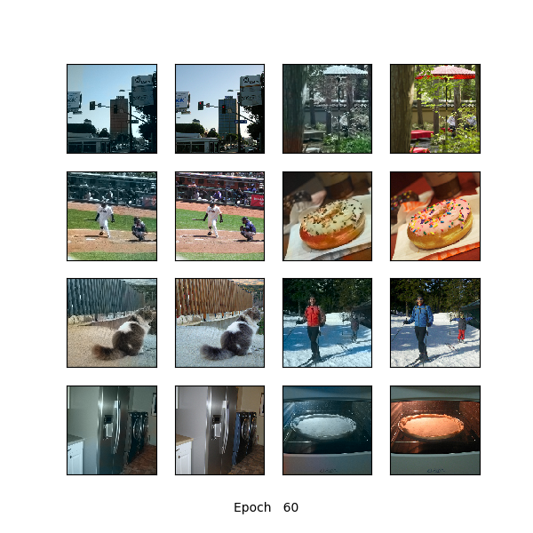
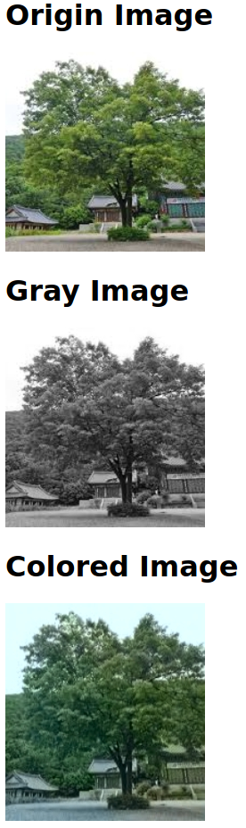
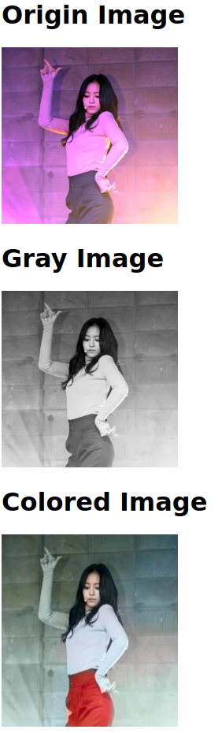
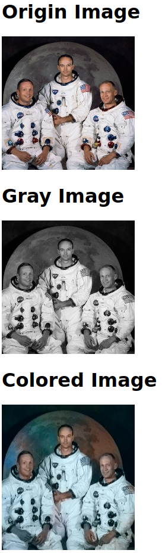
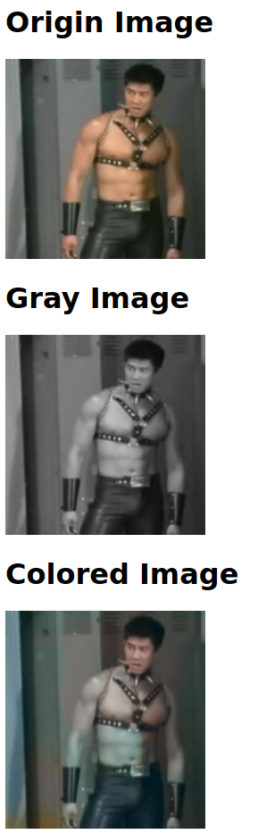

# 1.Overview
구현과정에서의 특징과 원본 논문과의 차이점을 기술한다.

# 2.Detail

MS-COCO Dataset을 사용하며, 병목을 피하기 위해 Image Resize 및, 색을 양자화해서 각각의 클래스로 매핑하는 작업을 미리 전처리해뒀고(Soft Encoding까지는 너무 용량이 커서 불가능), Rebalancing Weight Table과 a, b값을 클래스로 매핑하는 테이블도 미리 구현해뒀다. 이때 a,b값을 클래스로 매핑하는 테이블은 2차원 numpy array로 만들었는데, Soft-encoding을 위해 확률을 smoothing할 때, 가우시안 커널을 편하게 돌리기 위함이다.

또한 양자화를 간단하게 하기 위해 그냥 a, b값을 10으로 나누고 다시 10을 곱하는 방식을 사용했다. 이로인한 차이인지 내 구현의 경우 양자 갯수가 313개가 아닌 총 262개이다. 

또한 Data-dependent Weight Initialization을 사용하지 않았으며, 학습이 너무 답답해서 초기 Learning Rate를 논문에 언급된 값의 100배로 정했고, Adam이라 괜찮을거라 생각하고 Learning Rate Scheduling은 사용하지 않았다.  

그 외에 딱히 특기할 만한 점은 없다.

# 3.Result

왼쪽이 모델이 채색한 영상, 오른쪽이 GT이다.

확실히 자주 나타나는 물체들(풀, 하늘 등)은 빠르게 학습하지만, 그렇지 않은 물체들은 학습하는데 시간이 좀 걸렸다. Multimodal한 물체들의 경우 그냥 무채색으로 두는 경향이 있다.(사람의 옷 등) 결과물들의 채도는 확실히 전반적으로 회귀기반 모델들보다 높은 것 같다.

위 Image외의 몇몇 이미지에서 전반적으로 Consistency가 떨어지는 현상을 확인했다.

# 4.Web Implementation

데모서버 주소를 잠시 공개했다가 바로 포트 닫고 깃허브하면서 처음으로 히스토리 삭제했다. 해킹이 너무 무섭다.

확실히 MS-COCO 도메인에 가까운, General Image(풍경, 자연스러운 일상사진 등)들은 잘 채색하지만 그렇지 않은 이미지들은 잘 채색하지 못했다.그리고 사람의 얼굴은 잘 채색하지만 다른 신체부위(팔뚝이나 허벅지, 가슴 등)는 잘 채색하지 못했다. 데이터를 충분히 늘리면 해결할 수 있는 문제로 보인다. 그리고 사람의 옷색이라던가 몇몇 Multimodal한 물체들은 제멋대로 채색해버리는 문제가 있다. 이것은 모델 자체의 한계로 이 구조를 그대로 쓰는 것으로는 해결하기 어려운 문제로 보인다.
